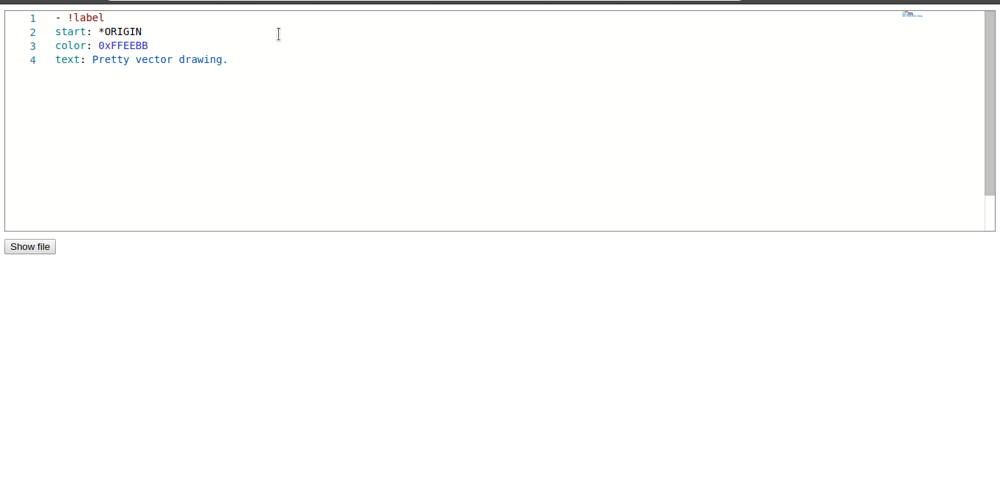

# Editor de Texto utilizando Monaco Editor

> Esta implementação foi apenas para testar como funciona essa biblioteca.

## Instalação

- Instale em seu terminal o Parcel. Ele é um empacotador de aplicação web. Servirá para executar sua aplicação em seu browser na url localhost:1234

`npm install -g parcel-bundler`

## Clonar

- Clone o repostório em questão em sua máquina <https://github.com/cdbarbosa/text-editor-monaco.git>

## Setup

> Instale os pacotes do npm ou bower

`npm install`
`bower install`

## Executando

> Depois que os pacotes do npm estiverem instalando você irá executar o seguinte código no terminal

`parcel index.html`
